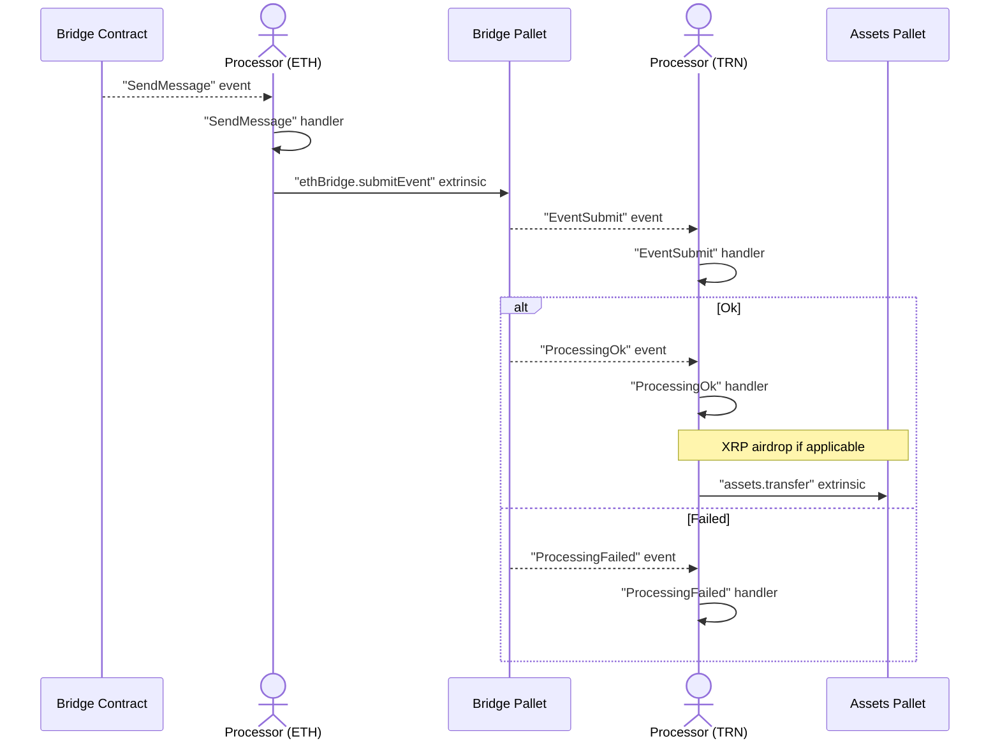
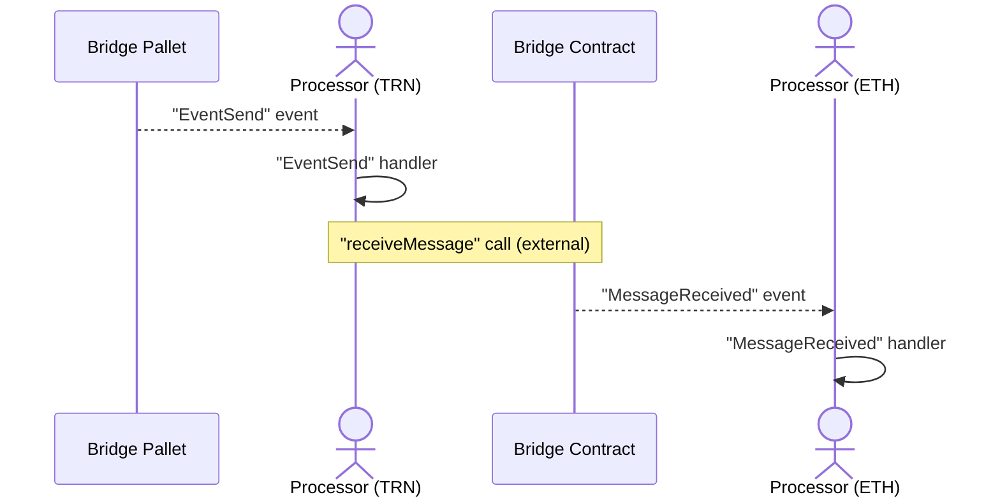
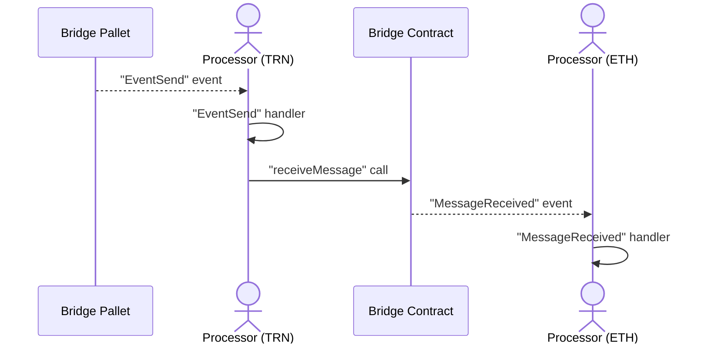

# Ethereum Bridge Daemon (EBD)

## Concepts

EBD purpose is to facilitate the deposit / withdrawal requests between Ethereum and The Root Network (TRN).

- Deposit: receive events from the Bridge Contract, then submit the deposit requests to The Root Network plus airdropping additional XRP as gas purchase
- Withdrwal: receive events from the Bridge Pallet, then store the event proof in the database, which to be fetched by the UI and submit to Ethereum separately (due to high gas cost in Ethereum network)

EBD consists of 2 main processor groups, `inbox` and `outbox` which handle deposit and withdrawal flows respectively. Each processor group is then split in 2 sides, EthSide and RootSide; depending on the request flow, either Eth Side or Root Side is responsible to initiate the crosschain requests.

### Deposit

> Deposit flow, EthSide Processor will initiate the request to TRN Chain

#### With Server

```
yarn call inbox processRootSide --key=EBD-IbxRootStatus
yarn call inbox processEthSide --key=EBD-IbxEthStatus
```

#### Without Server

```
yarn call:main inbox processRootSide
yarn call:main inbox processEthSide
```



### Withdrawal

> Withdrawal flow, but unlike deposit flow, RootSide Processor will NOT initiate the request to ETH Chain

#### With Server

```
yarn call outbox processEthSide --key=EBD-ObxEthStatus
yarn call outbox processRootSide --key=EBD-ObxRootStatus
```

#### Without Server

```
yarn call:main outbox processEthSide
yarn call:main outbox processRootSide
```



#### AuthSet Change

> Internal processor lives within the withdrawal flow, helps maintain the validators set in the Bridge Contract


