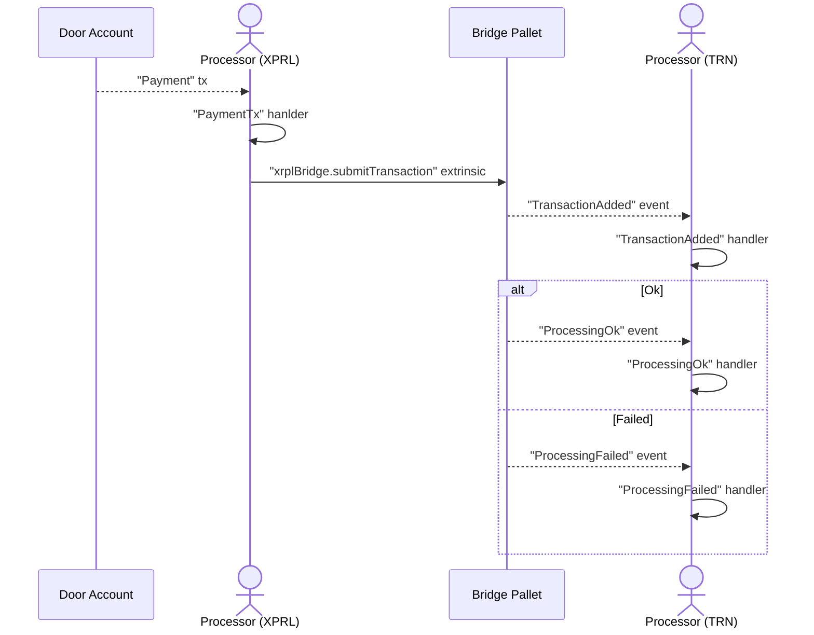
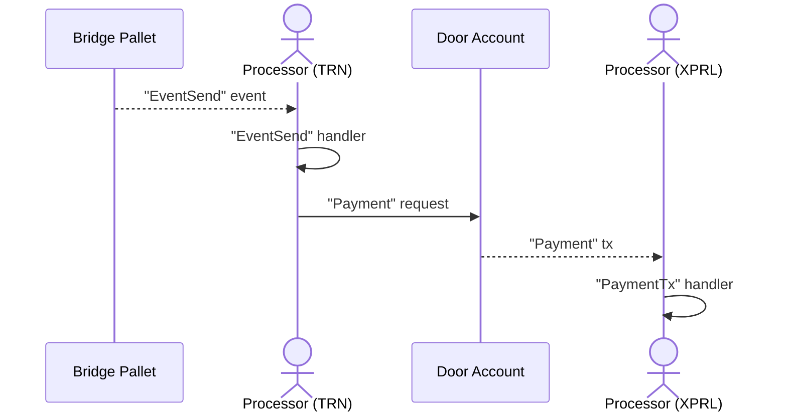
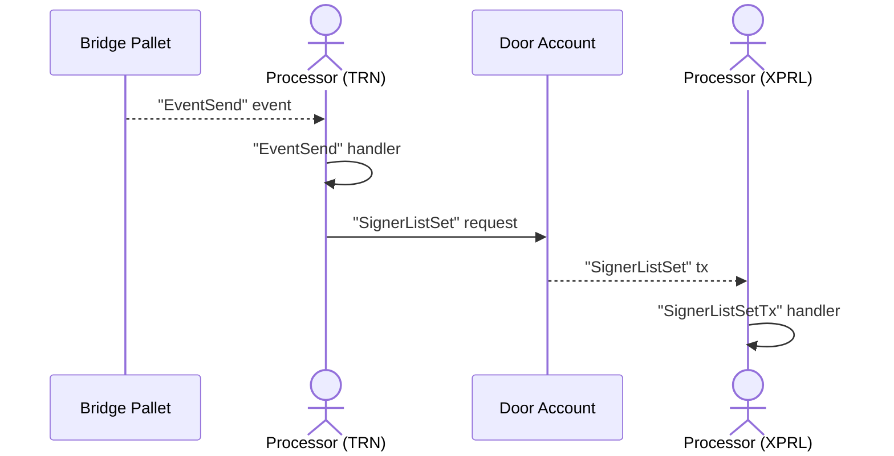
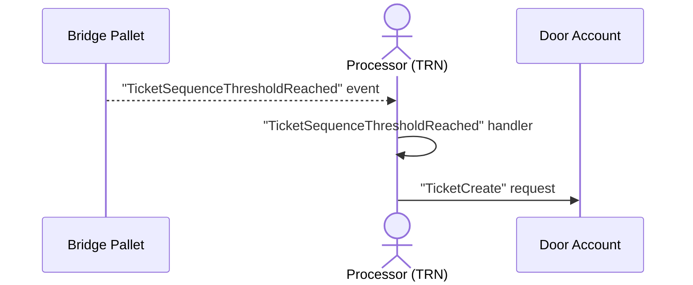

# XRPL Bridge Daemon (XBD)

## Concepts

XBD purpose is to facilitate the deposit / withdrawal requests between XRPL and The Root Network (TRN).

- Deposit: receive events from the Door Account, then submit the deposit requests to the Root Network.
- Withdrawal: similar to deposit, but the other way around.

XBD consists of 3 main processor groups, `inbox`, `outbox` and `ticket` which handle deposit, withdrawal and ticket monitor flows respectively. Each processor group is then split in 2 sides, XrplSide and RootSide; with one exception for `ticket` flow which only consists of one side: Root Side.

### Deposit

> Deposit flow, XrplSide Processor will initiate the request to TRN Chain

#### With Server

```
yarn call inbox processRootSide --key=XBD-IbxRootStatus
yarn call inbox processEthSide --key=XBD-IbxEthStatus
```

#### Without Server

```
yarn call:main inbox processRootSide
yarn call:main inbox processEthSide
```



### Withdrawal

> Withdrawal flow, RootSide Processor will initiate the request to XRPL Chain

#### With Server

```
yarn call outbox processEthSide --key=XBD-ObxEthStatus
yarn call outbox processRootSide --key=XBD-ObxRootStatus
```

#### Without Server

```
yarn call:main outbox processEthSide
yarn call:main outbox processRootSide
```



#### SignerList Set

> Internal processor lives within the withdrawal flow, helps maintain the validators list in the Door Account



### Ticket Monitor

> Another internal processor, used to topup the Ticket sequences for the Bridge Pallet to construct the Payment transaction

#### With Server

```
yarn call ticket processRootSide --key=XBD-TckRootStatus
```

#### Without Server

```
yarn call:main ticket processRootSide
```



Listen to the trustline

```
yarn call trustline checkAccountLines --key=XBD-ObxRootStatus
```
