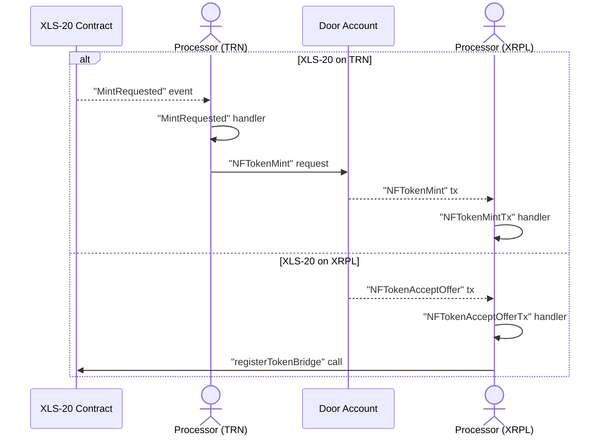
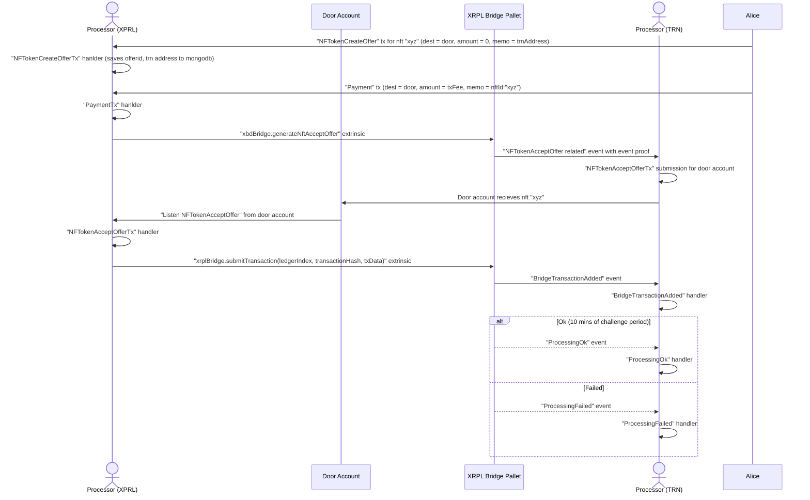
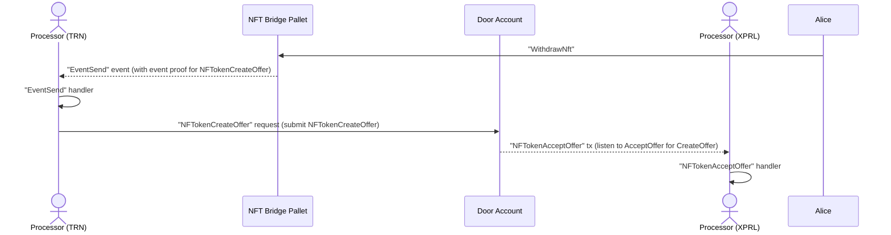

# XLS-20 Daemon (XLS20D)

## Concepts

1. XLS20D purpose is to facilitate the NFT Minting requests between XRPL and The Root Network (TRN).

- Serve Mint Request: receive events from the XLS20 Contract, then submit mint requests to XPRL network to "reserve" the unique Token ID.
- Fulfill Mint Request: The other part of the process, listen to certain events on the Mint Account to collect the Token IDs to register it back to the XLS20 Contract.

XLS20D similar to other crosschain services, consists eof 2 main processor group, `inbox` and `outbox`.

### With Server

```
yarn call outbox processRootSide --key=XLS20D-ObxRootStatus
yarn call outbox processXrplSide --key=XLS20D-ObxXrplStatus
```

### Without Server

```
yarn call:main outbox processRootSide
yarn call:main outbox processXrplSide
```



2. XLS20D is also responsible for bridging nfts from XRPL -> TRN and TRN -> XRPL

Bridging NFT consists of 3 main processor groups, `inbox`, `outbox` and `ticket` which handle deposit, withdrawal and ticket monitor flows respectively. Each processor group is then split in 2 sides, XrplSide and RootSide; with one exception for `ticket` flow which only consists of one side: Root Side.

### Deposit

> Deposit flow, XrplSide Processor will initiate the request to TRN Chain

### With Server

```
yarn call inbox processXrplSide --key=XLS20D-IbxXrplStatus
yarn call inbox processRootSide --key=XLS20D-IbxRootStatus
```

### Without Server

```
yarn call:main inbox processRootSide
yarn call:main inbox processXrplSide
```



### Withdrawal

> Withdrawal flow, RootSide Processor will initiate the request to XRPL Chain

### With Server

```
yarn call outbox processRootSide --key=XLS20D-ObxRootStatus
yarn call outbox processXrplSide --key=XLS20D-ObxXrplStatus
```

### Without Server

```
yarn call:main outbox processRootSide
yarn call:main outbox processXrplSide
```


